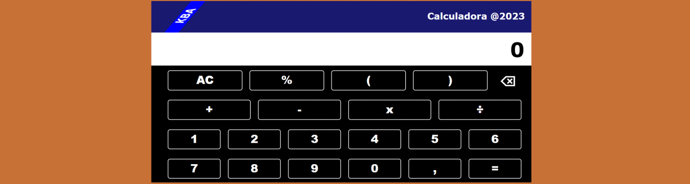

# **Calculadora**



## Sobre o projeto

Projeto: [trabalho de react js](https://react-calculadora-steel.vercel.app/)

Calculadora de teclas que realiza cálculos de fórmulas básicas.

Key calculator that performs basic formula calculations.

## Layout web e mobile 


## Tecnologias Utilizadas

* HTML 5
* CSS 3
* Flexbox
* React
* Strings:
    * Length
    * Substrings
    * lastIndexOf
    * Replace
    * ReplaceAll
* Regex
* Function Eval

## Ferramenta de desenvolvimento

<p float="left">
    
</p>

## Funcionalidades do projeto

* Possui até 17 dígitos (Has up to 17 digits)
* Dígitos Numéricos (Numeric Digits)
* Operadores ( + , - , x , ÷ ) (Operators (+, -, x, ÷))
* Cálculo de Porcentagem (Percentage Calculation)
* Uso de Parênteses (Use of Parentheses)
* Exibe a fórmula no visor (Displays the formula on the display)
* Calcula e exibe o valor total (Calculates and displays the total amount)
* Calcula e exibe o total com outros valores (Calculates and displays the total with other values)
* Exibe um aviso de erro caso a fórmula esteja incorreta (Displays an error warning if the formula is incorrect)


## Instalação do projeto

##### Instalação de dependências via terminal (Installing dependencies via terminal)
```
    npm install
```

## Execução do projeto

##### Iniciar o projeto (Start the project)
```
    npm start
```

## Autor

#### **Katarine Albuquerque**

<p float="left">
    <a href="https://www.linkedin.com/in/katarine-albuquerque/" target="_blank">
        
    </a>
    &nbsp;
    <a href="mailto:kba.2879@gmail.com" target="_blank">
        
    </a>
</p>
